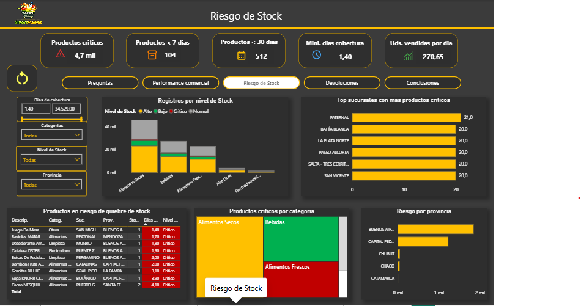
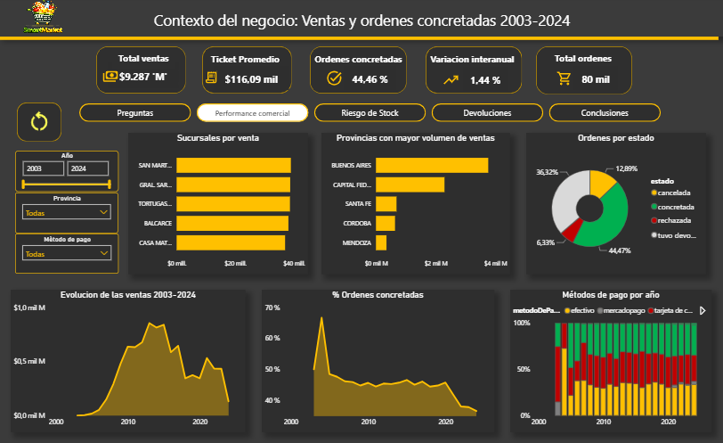

# 📦 Análisis y Predicción de Riesgo de Quiebre de Stock

Proyecto de analítica de datos aplicado a una cadena de supermercados, desarrollado como
trabajo integrador final de la **Diplomatura en Gestión y Analítica de Datos**.

Cubre el ciclo completo: modelado relacional, carga automatizada, limpieza y normalización,
análisis en SQL por capas, y un dashboard interactivo en Power BI con medidas DAX.

---

## 🎯 El problema de negocio

> **¿Cuáles productos y sucursales tienen riesgo real de quiebre de stock, considerando el
> nivel actual de inventario y los días de cobertura?**

Cuando un producto se agota en góndola, la empresa pierde la venta y el cliente pierde
confianza. El objetivo de este proyecto fue ir más allá de contar cuántas veces pasó esto, y
construir un sistema que permita anticiparlo.

## 📊 El dataset

| | |
|---|---|
| Sucursales | 433 |
| Productos | 14.834 |
| Órdenes analizadas | 80.000 |
| Período | 2003–2024 |
| Tablas de la base | 9 |
| Registros cargados en MySQL | 735.000+ |

## 🛠️ Stack utilizado

- **MySQL** — modelado relacional, normalización, consultas SQL en capas
- **Python** (pandas, SQLAlchemy) — carga automatizada de datos desde CSV/Excel a MySQL
- **Power BI** (Power Query, DAX) — limpieza, modelado de datos e informe interactivo

## 🧩 Estructura del análisis

El proyecto sigue las 4 capas de analítica de datos:

| Capa | Pregunta | Ejemplo en este proyecto |
|---|---|---|
| Descriptiva | ¿Qué pasó? | Evolución de ventas, categorías con mayor volumen |
| Diagnóstica | ¿Por qué pasó? | Concentración de riesgo por volumen, no por tasa |
| Predictiva | ¿Qué va a pasar? | Días de cobertura de stock según demanda diaria |
| Prescriptiva | ¿Qué hacer? | Alertas automáticas de reposición (Stored Procedure + Trigger) |

## 🔍 Hallazgos destacados

- **Concentración por volumen, no por tasa de riesgo**: Alimentos Secos y las provincias de
  Buenos Aires/CABA concentran más casos críticos en términos absolutos, pero su tasa de
  criticidad (~2,2%–2,7%) es prácticamente igual a la del resto de las categorías y
  provincias — el riesgo se explica por escala, no por un problema estructural puntual.
- **Discrepancia de trazabilidad en devoluciones**: 12.800 órdenes (16% del total) están
  marcadas con estado "tuvo devolución" pero no tienen ningún registro de detalle asociado.
  Se documentó con una medida DAX de control en vez de modificar el dato original.
- **Verificación de redundancia en el modelo**: se confirmó que `precioUnitario` en el detalle
  de órdenes coincidía 100% con el precio de catálogo en 319.745 filas — validando la decisión
  de normalización que lo eliminó por redundante.
- **Sin stock muerto por falta de demanda**: una consulta con `LEFT JOIN` confirmó que todos
  los productos en inventario tuvieron al menos una venta histórica.

## 🗂️ Estructura del repositorio

```
├── sql/
│   ├── 01_ddl_creacion_tablas.sql          # Creación del esquema
│   ├── 02_consultas_descriptivas.sql       # Capa descriptiva
│   ├── 03_consultas_diagnosticas.sql       # Capa diagnóstica
│   ├── 04_normalizacion_3fn.sql            # Normalización a 3FN + índices
│   └── 05_stored_procedure_trigger.sql     # Automatización (SP + Trigger)
├── python/
│   └── carga_datos_mysql.py                # Carga automatizada CSV/Excel → MySQL
├── powerbi/
│   ├── analisis_riesgo_stock.pbix
│   └── capturas/
│       ├── riesgo_de_stock.png
│       ├── performance_comercial.png
│       └── devoluciones.png
├── docs/
│   ├── der_modelo_relacional.png           # Diagrama entidad-relación
│   └── diagnostico_formas_normales.md      # Diagnóstico 1FN/2FN/3FN por tabla
└── README.md
```

## 🚀 Cómo reproducirlo

1. Crear la base de datos: `mysql -u root -p < sql/01_ddl_creacion_tablas.sql`
2. Configurar credenciales en `python/carga_datos_mysql.py` y ejecutar la carga:
   ```bash
   pip install pandas sqlalchemy pymysql openpyxl
   python python/carga_datos_mysql.py
   ```
3. Ejecutar las consultas de `sql/` en el orden numerado para reproducir el análisis
4. Abrir `powerbi/analisis_riesgo_stock.pbix` en Power BI Desktop y actualizar la conexión a
   tu instancia de MySQL

## 📸 Vista previa del dashboard

<!-- Reemplazar por las capturas reales -->
| Riesgo de Stock | Performance Comercial |
|---|---|
|  |  |

## 📚 Aprendizajes del proyecto

- Modelado relacional y resolución de claves compuestas en relaciones muchos-a-muchos
- Normalización aplicada con criterio: cada acción resuelve un problema diagnosticado, no
  normalización "por norma"
- SQL en capas, desde consultas descriptivas hasta objetos de automatización (Stored
  Procedures, Triggers)
- DAX intermedio: medidas de control para documentar problemas de calidad de datos sin
  alterar los datos originales
- Comunicación de hallazgos técnicos en un formato entendible para una audiencia de negocio

---

**Autor/a:** [Tu nombre] · Diplomatura en Gestión y Analítica de Datos
